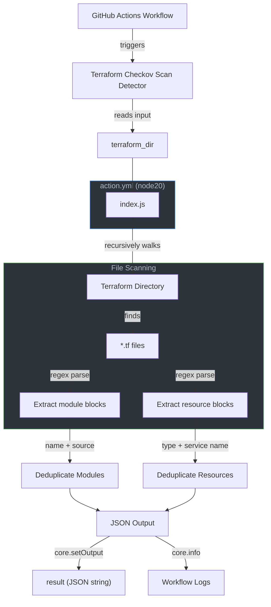

# Terraform Checkov Scan Detector

&nbsp;&nbsp;&nbsp;&nbsp;&nbsp;&nbsp;&nbsp;&nbsp;&nbsp;

A GitHub custom action that recursively scans a Terraform directory, parses all `.tf` files using regex, and outputs a JSON summary containing every module (with its source) and every resource (with its Terraform type and a human-readable service name).

## Architecture



## Project Structure

```text
.
├── action.yaml                          # Root composite action (entry point)
├── .github/
│   ├── actions/
│   │   └── tf-scanner/
│   │       ├── action.yml               # Action metadata (node20, inputs/outputs)
│   │       ├── index.js                 # Core logic: recursive walk, regex parse, JSON output
│   │       └── README.md                # Action-specific documentation
│   ├── workflows/
│   │   ├── create-branch.yaml           # Branch creation workflow
│   │   └── release.yaml                 # Semantic release workflow
│   └── CODEOWNERS                       # Code ownership rules
├── scripts/
│   └── plugins/                         # Semantic release custom plugins
│       ├── release.config.js
│       ├── analyze-commits.js
│       ├── generate-notes.js
│       ├── prepare.js
│       ├── publish.js
│       └── verify-conditions.js
├── package.json                         # Project dependencies (semantic-release)
├── package-lock.json
├── .releaserc.json                      # Semantic release configuration
├── .devcontainer/
│   └── devcontainer.json                # Dev container setup
├── CHANGELOG.md
├── CODE_OF_CONDUCT.md
├── CONTRIBUTING.md
└── LICENSE
```

## How It Works

1. A workflow triggers the action and provides the `terraform_dir` input (defaults to `tf`).
2. `index.js` recursively walks the specified directory, collecting all `.tf` files.
3. Each file is parsed with two regex patterns:
   - **Module regex** — extracts `module "name" { source = "..." }` blocks.
   - **Resource regex** — extracts `resource "type" "name" { }` blocks.
4. For each resource, a service name is derived by splitting the type on `_`, dropping the cloud provider prefix (e.g., `aws`, `google`, `azurerm`), uppercasing the remaining segments, and joining them with underscores (e.g., `aws_s3_bucket` -> `S3_BUCKET`).
5. Results are deduplicated and serialized as a JSON string.
6. The JSON is set as the `result` output and printed to the workflow logs.
7. If a `gist_id` and `github_token` are provided, the action fetches `checkov-scan-mapping.json` from the private gist and prints its content to the logs.

## Inputs

| Name            | Description                                                        | Required | Default                            |
|-----------------|--------------------------------------------------------------------|----------|------------------------------------|
| `terraform_dir` | Path to the Terraform directory to scan, relative to the repo root | No       | `tf`                               |
| `gist_id`       | ID of the private gist containing checkov-scan-mapping.json        | No       | `1b434fbced86f74e1a8dd42c7ec09bd8` |
| `github_token`  | GitHub token with gist scope for fetching private gists            | Yes      | —                                  |

## Outputs

| Name           | Description                                                                                                     |
|----------------|-----------------------------------------------------------------------------------------------------------------|
| `result`       | JSON string containing `modules` (array of `{ name, source }`) and `resources` (array of `{ type, service }`). |
| `gist_mapping` | JSON string with the content of checkov-scan-mapping.json from the private gist.                                |

## Example Usage

```yaml
name: Example Workflow

on:
  issues:
    types: [opened]

jobs:
  example:
    runs-on: ubuntu-latest
    steps:
      - name: Checkout
        uses: actions/checkout@v6

      - name: Run Terraform Checkov Scan Detector
        uses: subhamay-bhattacharyya-gha/terraform-checkov-scan-detector@v1
        with:
          terraform_dir: "tf"
          github_token: ${{ secrets.GITHUB_TOKEN }}
```

## Sample Output

```json
{
  "modules": [
    { "name": "vpc", "source": "terraform-aws-modules/vpc/aws" }
  ],
  "resources": [
    { "type": "aws_s3_bucket", "service": "S3_BUCKET" },
    { "type": "aws_iam_role", "service": "IAM_ROLE" },
    { "type": "google_storage_bucket", "service": "STORAGE_BUCKET" },
    { "type": "azurerm_virtual_network", "service": "VIRTUAL_NETWORK" }
  ]
}
```

## License

MIT
